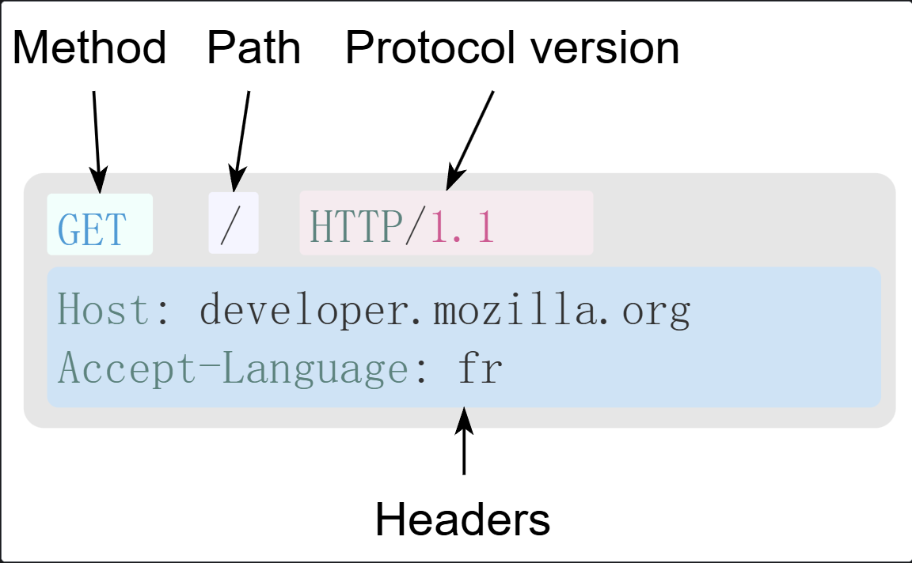
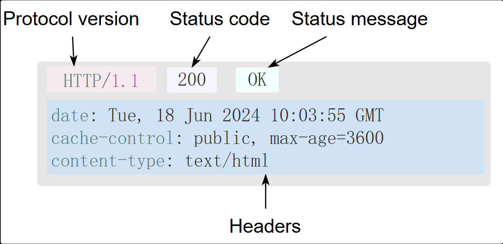
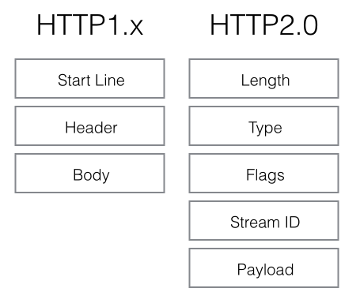
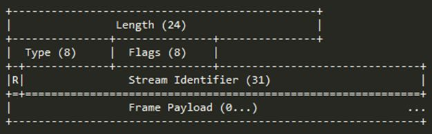

+++
date = '2026-05-14T00:00:00+08:00'
draft = false
title = 'HTTP'
tags = ['web', 'http']
+++
# HTTP

## 概述

> HTTP（超文本传输协议，Hypertext Transfer Protocol）是一种用于从网络传输超文本到本地浏览器的传输协议。它定义了客户端与服务器之间请求和响应的格式。HTTP 工作在 TCP/IP 模型之上，通常使用端口 80。
>
> HTTPS（超文本传输安全协议，Hypertext Transfer Protocol Secure）是 HTTP 的安全版本，它在 HTTP 下增加了 SSL（Secure Socket Layer）/TLS（Transport Layer Security） 协议，提供了数据加密、完整性校验和身份验证。HTTPS 通常使用端口 443。

### HTTP工作原理

1. ​**客户端发起请求**：用户通过客户端（如浏览器）输入 URL，客户端向服务器发起一个 HTTP 请求。
2. ​**服务器处理请求**：服务器接收到请求后，根据请求的类型（如GET、POST等）和请求的资源，进行相应的处理。
3. ​**服务器返回响应**：服务器将处理结果包装成HTTP响应消息，发送回客户端。
4. ​**客户端渲染页面**：客户端接收到响应后，根据响应内容（如HTML、图片等）渲染页面，展示给用户。

[Web 服务器](Web机制.md#20260513235616-4o4nsq5)有：Nginx 服务器，Apache 服务器，IIS 服务器（Internet Information Services）等。

### HTTP四大特性

1. 基于请求响应
2. 基于TCP/IP作用于应用层之上的协议
3. 无状态

   不保存用户的信息

   但是后来出现了用来记录用户状态的技术，cookie,session,token...
4. 无/短链接

   请求来一次相应一次，之后两个就没有连接状态了

   长连接：双人建立连接后默认不断开 websocket

### HTTP 流

当客户端想要和服务器——不管是最终的服务器还是中间的代理——进行信息交互时，过程表现为下面几步：

1. 打开一个 TCP 连接：TCP 连接被用来发送一条或多条请求，以及接受响应消息。客户端可能打开一条新的连接，或重用一个已经存在的连接，或者也可能开几个新的与服务器的 TCP 连接。
2. 发送一个 HTTP 报文：HTTP 报文（在 HTTP/2 之前）是人类可读的。在 HTTP/2 中，这些简单的消息被封装在了帧中，这使得报文不能被直接读取，但是原理仍是相同的。例如：

   ```http
   GET / HTTP/1.1
   Host: developer.mozilla.org
   Accept-Language: zh
   ```
3. 读取服务端返回的报文信息：

   ```http
   HTTP/1.1 200 OK
   Date: Sat, 09 Oct 2010 14:28:02 GMT
   Server: Apache
   Last-Modified: Tue, 01 Dec 2009 20:18:22 GMT
   ETag: "51142bc1-7449-479b075b2891b"
   Accept-Ranges: bytes
   Content-Length: 29769
   Content-Type: text/html

   <!DOCTYPE html>…（此处是所请求网页的 29769 字节）
   ```
4. 关闭连接或者为后续请求重用连接。

当启用 HTTP 流水线(pipelining时，后续请求都可以直接发送，而不用等待第一个响应被全部接收。然而 HTTP 流水线已被证明很难在现有的网络中实现，因为现有网络中有老旧的软件与现代版本的软件同时存在。因此，HTTP 流水线已在 HTTP/2 中被更健壮、使用帧的多路复用请求所取代。

### [HTTP 报文](#20260514170827-zh6cklx)

HTTP/1.1 以及更早的 HTTP 协议报文都是语义可读的。在 HTTP/2 中，这些报文被嵌入到了一个新的二进制结构，帧。帧允许实现很多优化，比如报文标头的压缩以及多路复用。即使只有原始 HTTP 报文的一部分以 HTTP/2 发送出来，每条报文的语义依旧不变，客户端会重组原始 HTTP/1.1 请求。因此用 HTTP/1.1 格式来理解 HTTP/2 报文仍旧有效。

有两种 HTTP 报文的类型，请求与响应，每种都有其特定的格式。

#### 请求

HTTP 请求的一个例子：



请求由以下元素组成：

- HTTP 方法，通常是由一个动词，像 GET、POST 等，或者一个名词，像 OPTIONS、HEAD 等，来定义客户端执行的动作。典型场景有：客户端意图获取某个资源（使用 GET）；发送 HTML 表单的参数值（使用 POST）；以及其他情况下需要的那些其他操作。
- 要获取的那个资源的路径——去除了当前上下文中显而易见的信息之后的 URL，比如说，它不包括协议（http://）、
- 域名（这里是 developer.mozilla.org），或是 TCP 的端口（这里是 80）。
- HTTP 协议版本号。
- 为服务端表达其他信息的可选标头。
- 请求体（body），类似于响应中的请求体，一些像 POST 这样的方法，请求体内包含需要了发送的资源。

#### 响应

HTTP 响应的一个例子：



响应报文包含了下面的元素：

- HTTP 协议版本号。
- 响应状态码，来指明对应请求已成功执行与否，以及不成功时相应的原因。
- 状态信息，这个信息是一个不权威、简短的状态码描述。
- HTTP 标头，与请求标头类似。
- 可选项，一个包含了被获取资源的主体。

## HTTP版本差异

### HTTP/1 和 HTTP/1.1 差异

往下读之前，要先理解之所以会有 HTTP/1.1 是因为 HTTP/1 有一些不那么理想的地方。因此建议不要死背差异，而是从「 HTTP/1.1 解决了什么问题」出发来理解。

#### 持久连接 (keep-alive)

HTTP/1 在发送每个请求之前都需要建立一个新的连接，而每次连接都是有成本的，这种每次重连的方式会造成很多频宽的浪费，以及时间的延迟。而 HTTP/1.1 默认使用持久连接，让 HTTP/1.1 可以使用同一个 TCP 连接来重复多个 HTTP 请求，这么一来就可以避免每次重新建立连接造成的频宽浪费、时间延迟。

#### 状态码 `100 (Continue)`

在某些情况下，服务器端会拒绝客户端发送的请求，因为发请求时可能会夹带正文 (request body)，所以每次请求被拒绝都会造成频宽上的额外浪费。在 HTTP/1 没有机制避免这种类型的浪费，而 HTTP/1.1 的 `100 (Continue) `状态码则可以协助我们避免这种浪费。

具体来说，HTTP/1.1 让使用者端先送出一个只含有标头、不带内文的请求到服务器，服务器确认没有问题之后，会回应状态码`100 (Continue)`​；收到` 100 (Continue) `​后，客户端才会正式发一个带有正文的请求；如果没有收到，则代表服务器端不接受该请求，这让客户端知道服务器端不接受，这能让客户端可以避免发带有正文的请求，进而减少传输上的频宽浪费。 [(详细请见 RFC 的这个段落)](https://www.rfc-editor.org/rfc/rfc2616#section-8.2.3)。

#### 快取缓存

HTTP/1 主要使用标头中的If-Modified-Since、Expires 来做为缓存的判断标准，这两者都是以时间作为依据；HTTP/1.1 则引入更多的缓存策略，例如：Etag、If-Unmodified-Since、If-Match、If-None-Match，透过这些可以更优化缓存的实现。

延伸阅读：[请解释 HTTP caching 机制](https://www.explainthis.io/zh-hans/swe/http-caching/)

#### Host 字段

HTTP/1.1 增加了 Host 字段，用来指定服务器的域名。在 HTTP/1 中，会认为每台服务器都绑定唯一的 IP 地址，因此请求当中的 URL 并没有传递主机名(hostname)。但随着之后虚拟主机技术的演进，现在在一台服务器上可以存在多个虚拟主机，并且他们会共享同一个 IP 地址。所以有了 host 字段之后，就可以将请求发往同一台服务器上的不同网站。

#### 更多请求方法

HTTP/1.1 相对于 HTTP/1 新增了许多请求方法，现今我们常用的PUT、PATCH、DELETE、CONNECT、TRACE 和OPTIONS 等都是在 HTTP/1.1 时新增的。

### HTTP/2 和 HTTP/1.1 比较

#### 多路复用(Request multiplexing) 来解决头部阻塞 (head-of-line blocking)

HTTP/1.1 使用了 pipelining 的机制，这可以让客户端在同一个 TCP 连接内并行发出多个 HTTP 请求，客户端也不需要等待上一次请求结果返回，就可以发出下一次请求，但服务器端必须依照接收到的客户端请求的先后顺序一次返回，以保证客户端能够区分出每次请求的回应内容，<u>但这项机制在实作上较难实现，因此各家浏览器，都将此功能预设为关闭</u>([可以参考此篇 Stack Overflow](https://stackoverflow.com/questions/30477476/why-is-pipelining-disabled-in-modern-browsers))。

此外 pipeline 也造成头部阻塞 (head-of-line blocking, HOL) 问题，如果有任一个请求要操作很久或传输包流失，那就会阻塞整个 pipeline 的工作。

HTTP/2 引进了多路复用的机制，让同一个 TCP 连接中，同时发送和接受多个请求，并且不用等到前一个请求收到回应，透过这个机制，解决了过往在 HTTP 层级的的头部阻塞问题(备注：但 TCP 层级仍有头部阻塞问题，这会在 HTTP/3 被解决)。

延伸阅读：[TCP 与 UDP 是什么？差异为何？](https://www.explainthis.io/zh-hans/swe/tcp-udp/)

#### 优先请求顺序

HTTP/2 版本中，每个请求或回应的所有数据包，称之为一个数据流，并且，每个数据流拥有一个唯一编号 ID (`stream ID`)。每个数据包在发送的时候就会戴上对应的数据流编号 ID，客户端还能指定数据流的优先级，优先级越高服务器也会越快做出回应。

#### 标头 (Header) 讯息压缩

在 HTTP/2 之前因为安全性问题，多数不会对标头的讯息进行压缩，主要是过去的采用的演算法可能遭受 CRIME 攻击。在 HTTP/2 中，使用 HPACK 算法来避免攻击，进而能压缩标头。因为压缩标头，让传输时能大幅减少传输的讯息量，进而减少频宽负担，也增快传输速度。具体上 HPACK 使用一份索引表来定义常用的 http header，并把 http header 存放在表里，请求的时候只需要发送在表里的索引位置即可，不须用传完整的标头。

#### 服务器主动推送(Server push)

HTTP/2 允许服务器端主动向客户端推送数据，这能协助减少客户端的请求次数。举例来说，浏览器在过去要请求`index.html `​与`style.css`​ 来渲染完整的画面；透过 Server Push，可以在浏览器请求`index.html`​ 时，也由服务器主动发送`style.css` ，这样只需要一轮 HTTP 的请求，就可以拿到所需的所有资源。

### HTTP/3

http3是为了解决http2相关问题而诞生，它基于一个新的传输层协议QUIC，而http3就是建立一个在QUIC上运行的HTTP新规范，而http3之前的版本都是基于TCP，QUIC就是为了替代TCP，解决TCP的一些缺陷

## <span id="20260514170827-zh6cklx" style="display: none;"></span>HTTP 消息

HTTP 消息是服务器和客户端之间交换数据的方式。有两种类型的消息：  
请求（request）——由客户端发送用来触发一个服务器上的动作；  
响应（response）——来自服务器的应答。

HTTP 消息由采用 ASCII 编码的多行文本构成。在 HTTP/1.1 及早期版本中，这些消息通过连接公开地发送。在 HTTP/2 中，为了优化和性能方面的改进，曾经可人工阅读的消息被分到多个 HTTP 帧中。

Web 开发人员或网站管理员，很少自己手工创建这些原始的 HTTP 消息：由软件、浏览器、代理或服务器完成。他们通过配置文件（用于代理服务器或服务器），API（用于浏览器）或其他接口提供 HTTP 消息。

HTTP/2 二进制框架机制被设计为不需要改动任何 API 或配置文件即可应用：它大体上对用户是透明的。

HTTP 请求和响应具有相似的结构，由以下部分组成：

1. 一行起始行用于描述要执行的请求，或者是对应的状态，成功或失败。这个起始行总是单行的。
2. 一个可选的 HTTP 标头集合指明请求或描述消息主体（body）。
3. 一个空行指示所有关于请求的元数据已经发送完毕。
4. 一个可选的包含请求相关数据的主体（比如 HTML 表单内容），或者响应相关的文档。主体的大小有起始行的 HTTP 头来指定。

起始行和 HTTP 消息中的 HTTP 头统称为请求头，而其有效负载被称为消息主体。

### HTTP 请求

#### 起始行

HTTP 请求是由客户端发出的消息，用来使服务器执行动作。起始行（start-line）包含三个元素：

1. 一个 HTTP 方法，一个动词（像 GET、PUT 或者 POST）或者一个名词（像 HEAD 或者 OPTIONS），描述要执行的动作。例如，GET 表示要获取资源，POST 表示向服务器推送数据（创建或修改资源，或者产生要返回的临时文件）。
2. 请求目标（request target），通常是一个 URL，或者是协议、端口和域名的绝对路径，通常以请求的环境为特征。请求的格式因不同的 HTTP 方法而异。它可以是：

   - 一个绝对路径，末尾跟上一个 '?' 和查询字符串。这是最常见的形式，称为原始形式（origin form），被 GET、POST、HEAD 和 OPTIONS 方法所使用。

     - ​`POST / HTTP/1.1`
     - ​`GET /background.png HTTP/1.0`
     - ​`HEAD /test.html?query=alibaba HTTP/1.1`
     - ​`OPTIONS /anypage.html HTTP/1.0`
   - 一个完整的 URL，被称为绝对形式（absolute form），主要在使用 GET 方法连接到代理时使用。`GET http://developer.mozilla.org/zh-CN/docs/Web/HTTP/Messages HTTP/1.1`
   - 由域名和可选端口（以 ':' 为前缀）组成的 URL 的 authority 部分，称为 authority form。仅在使用 `CONNECT `​建立 HTTP 隧道时才使用。`CONNECT developer.mozilla.org:80 HTTP/1.1`
   - 星号形式（asterisk form），一个简单的星号（`'*'`​），配合` OPTIONS `​方法使用，代表整个服务器。`OPTIONS * HTTP/1.1`
3. HTTP 版本（HTTP version），定义了剩余消息的结构，作为对期望的响应版本的指示符。

#### 标头（Header）

来自请求的 HTTP 标头遵循和 HTTP 标头相同的基本结构：不区分大小写的字符串，紧跟着的冒号（`':'`）和一个结构取决于标头的值。整个标头（包括值）由一行组成，这一行可以相当长。

有许多请求标头可用，它们可以分为几组：

- [通用标头（General header）](https://developer.mozilla.org/zh-CN/docs/Glossary/General_header)，例如 Via，适用于整个消息。
- [请求标头（Request header）](https://developer.mozilla.org/zh-CN/docs/Glossary/Request_header)，例如 User-Agent、Accept-Type，通过进一步的定义（例如 Accept-Language）、给定上下文（例如 Referer）或者进行有条件的限制（例如 If-None）来修改请求。
- [表示标头（Representation header）](https://developer.mozilla.org/zh-CN/docs/Glossary/Representation_header)，例如 Content-Type 描述了消息数据的原始格式和应用的任意编码（仅在消息有主体时才存在）。

#### 主体（Body）

请求的最后一部分是它的主体。不是所有的请求都有一个主体：例如获取资源的请求，像 GET、HEAD、DELETE 和 OPTIONS，通常它们不需要主体。有些请求将数据发送到服务器以便更新数据：常见的情况是 POST 请求（包含 HTML 表单数据）。

主体大致可分为两类：

- 单一资源（Single-resource）主体，由一个单文件组成。该类型的主体由两个标头定义：Content-Type 和 Content-Length。
- 多资源（Multiple-resource）主体，由多部分主体组成，每一部分包含不同的信息位。通常是和 HTML 表单连系在一起。

### HTTP 响应

#### 状态行

HTTP 响应的起始行被称作状态行（status line），包含以下信息：

1. 协议版本，通常为 HTTP/1.1。
2. 状态码（status code），表明请求是成功或失败。常见的状态码是 200、404 或 302。
3. 状态文本（status text）。一个简短的，纯粹的信息，通过状态码的文本描述，帮助人们理解该 HTTP 消息。

一个典型的状态行看起来像这样：HTTP/1.1 404 Not Found。

#### 标头（Header）

响应的 HTTP 标头遵循和任何其他标头相同的结构：不区分大小写的字符串，紧跟着的冒号（':'）和一个结构取决于标头类型的值。整个标头（包括其值）表现为单行形式。

许多不同的标头可能会出现在响应中。这些可以分为几组：

- [通用标头（General header）](https://developer.mozilla.org/zh-CN/docs/Glossary/General_header)，例如 Via，适用于整个消息。
- [响应标头（Response header）](https://developer.mozilla.org/zh-CN/docs/Glossary/Response_header)，例如 Vary 和 Accept-Ranges，提供有关服务器的其他信息，这些信息不适合状态行。
- [表示标头（Representation header）](https://developer.mozilla.org/zh-CN/docs/Glossary/Representation_header)，例如 Content-Type 描述了消息数据的原始格式和应用的任意编码（仅在消息有主体时才存在）。

#### 主体（Body）

响应的最后一部分是主体。不是所有的响应都有主体：具有状态码（如 201 或 204）的响应，通常不会有主体。

主体大致可分为三类：

- 单资源（Single-resource）主体，由已知长度的单个文件组成。该类型主体由两个标头定义：Content-Type 和 Content-Length。
- 单资源（Single-resource）主体，由未知长度的单个文件组成。通过将 Transfer-Encoding 设置为 chunked 来使用分块编码。
- 多资源（Multiple-resource）主体，由多部分 body 组成，每部分包含不同的信息段。但这是比较少见的。

### HTTP/2 帧

HTTP/1.x 消息有一些性能上的缺点：

- 与主体不同，标头不会被压缩。
- 两个消息之间的标头通常非常相似，但它们仍然在连接中重复传输。
- 无法多路复用。当在同一个服务器打开几个连接时：TCP 热连接比冷连接更加有效。

http2 .0并没有改变http1.x的语义，只是把原来http1.x的header和body部分用frame重新封装了一层而已



- Headers Frame: 帧头  
  固定的9个字节（(24+8+8+1+31)/8=9）呈现，变化的为帧的负载(Frame Payload )，负载内容是由帧类型（Type）定义。

- Length: 帧长度  
  无符号的自然数，24个比特表示，仅表示帧负载（Frame Payload）所占用字节数，不包括帧头所占用的9个字节。 默认大小区间为为0~16,384(2<sup>14)，一旦超过默认最大值2</sup>14(16384)，发送方将不再允许发送，除非接收到接收方定义的SETTINGS_MAX_FRAME_SIZE（一般此值区间为2<sup>14 ~ 2</sup>24）值的通知。
- Type帧类型  
  8个比特表示，定义了帧负载的具体格式和帧的语义，HTTP/2规范定义了10个帧类型，这里不包括实验类型帧和扩展类型帧
- Flags:帧的标志位  
  8个比特表示，服务于具体帧类型，默认值为0x0。 8个比特可以容纳8个不同的标志，比如，PADDED值为0x8，二进制表示为00001000；END_HEADERS值为0x4，二进制表示为00000100；END_STREAM值为0X1，二进制为00000001。可以同时在一个字节中传达三种标志位，二进制表示为00001101，即0x13。因此，后面的帧结构中，标志位一般会使用8个比特表示，若某位不确定，使用问号?替代，表示此处可能会被设置标志位
- R:帧保留比特位  
  HTTP/2语境下为保留的比特位，固定值为0X0。  
  Stream Identifier：流标识符  
  无符号的31比特表示无符号自然数。0x0值表示为帧仅作用于连接，不隶属于单独的流。

HTTP/2 引入了一个额外的步骤：它将 HTTP/1.x 消息分成帧并嵌入到流（stream）中。数据帧和报头帧分离，这将允许报头压缩。将多个流组合，这是一个被称为多路复用（multiplexing）的过程，它允许更有效的底层 TCP 连接。

本质上还是序列化的传输，举个例子。比如饭店上菜，http1就是上完第一桌客人的再上第二桌客人的。http2就变成根据炒出来的菜的编号属于哪个桌就上哪个桌

HTTP 帧现在对 Web 开发人员是透明的。在 HTTP/2 中，这是一个在 HTTP/1.1 和底层传输协议之间附加的步骤。Web 开发人员不需要在其使用的 API 中做任何更改来利用 HTTP 帧；当浏览器和服务器都可用时，HTTP/2 将被打开并使用。

## [HTTP2](HTTP/HTTP2.md)

## [HTTP3](HTTP/HTTP3.md)

‍
