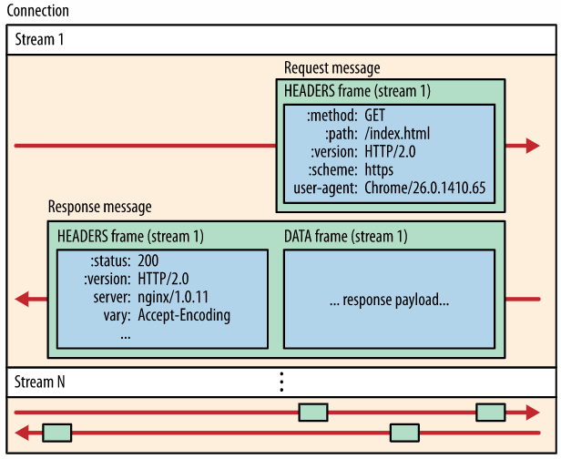
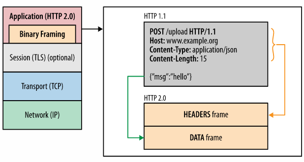
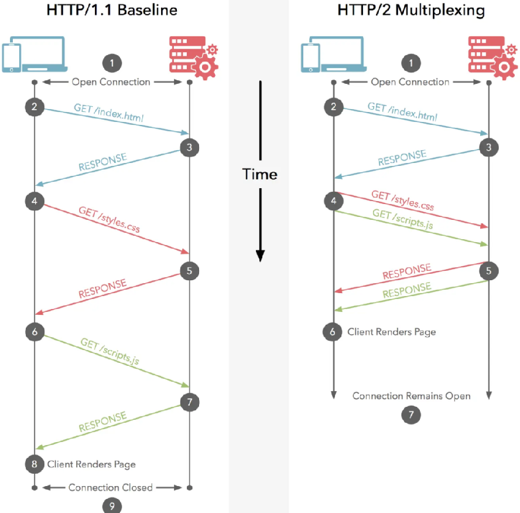
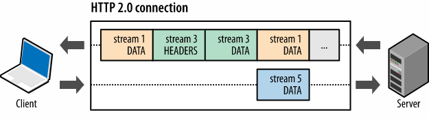
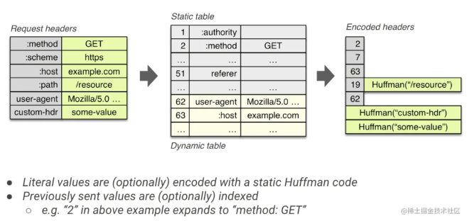
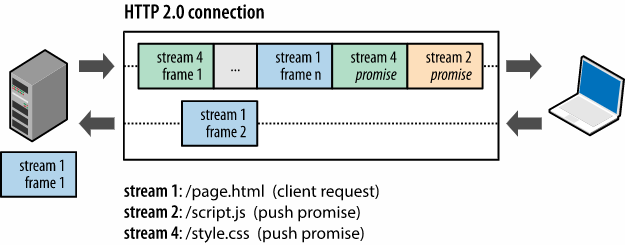

+++
date = '2026-05-23T00:00:00+08:00'
draft = false
title = 'HTTP/2'
tags = ['web', 'http', 'http2']
+++
# HTTP2

## 一、HTTP2 简介

HTTP2 是第二代应用层传输协议，核心技术脱胎于谷歌SPDY协议，SPDY团队全程参与协议制定。  
该协议由互联网工程任务组IETF的httpbis工作组研发，主流浏览器在2015年底完成兼容支持。

## 二、HTTP1.1 现存痛点

### 2.1 协议设计冗余繁琐

协议定义细节繁多，预留大量扩展接口，无软件能够完整实现全部规范；请求头字段相似度高，部分冷门功能后期才逐步投入使用，HTTP管道化可小幅提升传输效率。

### 2.2 TCP性能无法充分利用

协议机制限制TCP原生性能发挥，客户端只能额外采取优化手段，缩减页面加载耗时。

### 2.3 网络延迟问题凸显

网页资源数量、体积持续增长，资源下载滞后直接拖慢页面渲染，降低用户体验。HTTP1.1推出管道化方案，将多个请求在单TCP连接串行发送，无需等待前置响应。

### 2.4 头部队列阻塞（Head-of-line blocking）

管道化机制带来阻塞缺陷：请求按序发送，响应也必须严格按序返回。  
首个响应处理缓慢，会阻塞后续所有应答，服务端按序回包也消耗大量资源；网页静态资源无法并行解析，整体处理效率偏低。

## 三、HTTP2 整体优化思路

1. **头部压缩**：采用HPACK算法压缩请求头，缩减报文体积
2. **解决头阻塞**：依托流、消息、帧三层核心概念重构传输模型
3. **降低传输延迟**：全新架构优化数据收发逻辑
4. **核心新增特性**：多路复用、服务端推送、二进制报文编码

## 四、HTTP2 核心特性概览

- 二进制分帧传输
- 请求头部字段压缩
- 连接多路复用
- 服务端主动推送资源
- 流量控制与资源优先级调度

## 五、HTTP2 协议深度解析

### 5.1 协议基础概述

HTTP2**完全兼容HTTP1.1语义**，请求方法、状态码、URI、请求头规则均保留，仅重构传输编码方式。

1. **帧**：最小传输单元，划分多类功能帧，支撑请求应答、连接管控等能力
2. **多路复用**：单TCP连接划分独立逻辑流，单流阻塞互不影响，无需重复建立连接
3. **流量与优先级**：按需分配传输带宽，优先加载核心资源
4. **服务端推送**：主动向客户端下发关联资源，减少请求轮次
5. **二进制编码**：摒弃文本格式，二进制报文传输效率更高

协议标识区分：

- ​`h2`：基于TLS加密的HTTP2协议
- ​`h2c`：TCP明文传输的HTTP2协议

### 5.2 协议升级方式

#### 5.2.1 明文Upgrade升级（h2c）

客户端基于HTTP1.1发起请求，携带升级标识，协商切换HTTP2协议

```http
GET / HTTP/1.1
Host: server.example.com
Connection: Upgrade, HTTP2-Settings
Upgrade: h2c
HTTP2-Settings: base64编码配置信息
```

服务端支持则返回**101协议切换**状态码，随后传输二进制帧数据。  
参考规范：RFC7540

#### 5.2.2 HTTPS加密升级（h2）

依托TLS层ALPN应用层协议协商扩展，在握手阶段完成协议选型，摒弃旧NPN协商机制。  
TLS握手流程：客户端与服务端交互握手报文，携带协议扩展字段，协商选定HTTP2协议后，再传输业务数据。

### 5.3 核心基础概念

#### 5.3.1 帧、消息、流

- **帧Frame**：最小通信单元，携带所属流ID，承载各类控制与业务数据
- **消息Message**：由一帧或多帧组成，对应单次请求、响应报文
- **流Stream**：TCP连接内虚拟双向通道，唯一整数ID标识，单连接可并发多条流，实现多路复用

层级关系：连接 > 流 > 消息 > 帧



#### 5.3.2 二进制分帧层

HTTP1.1为明文文本报文，HTTP2将所有数据拆分为二进制帧统一传输，统一数据交互格式。



#### 5.3.3 通用帧结构

固定9字节帧头 + 可变长度负载

```
+-----------------------------------------------+
|                 Length (24)                   |
+---------------+---------------+---------------+
|   Type (8)    |   Flags (8)   |
+-+-------------+---------------+-------------------------------+
|R|                 Stream Identifier (31)                      |
+=+=============================================================+
|                   Frame Payload (0...)
+---------------------------------------------------------------+
```

字段释义

- Length：24位，负载字节长度
- Type：8位，帧功能类型
- Flags：8位，帧状态标识
- Stream Identifier：31位，所属流编号
- Frame Payload：帧实际数据内容

#### 5.3.4 十大帧类型

|帧类型|编码|作用说明|
| ---------------| ------| ------------------------------|
|DATA|0x00|传输业务主体数据|
|HEADERS|0x01|携带请求响应头部，创建数据流|
|PRIORITY|0x02|设置流优先级（现已弃用）|
|RST_STREAM|0x03|强制终止异常数据流|
|SETTINGS|0x04|配置连接全局参数|
|PUSH_PROMISE|0x05|发起服务端资源推送预告|
|PING|0x06|检测连接存活、测算网络时延|
|GOAWAY|0x07|优雅关闭整条TCP连接|
|WINDOW_UPDATE|0x08|流量控制，调整传输窗口|
|CONTINUATION|0x09|超长头部数据延续传输|

#### 5.3.5 常用帧结构

1. **DATA数据帧**：承载网页、接口等业务数据，支持填充位混淆报文长度，END_STREAM标记流结束
2. **HEADERS头部帧**：存储请求响应首部信息，搭配延续帧完成长头部传输

## 六、核心特性详解

### 6.1 多路复用

HTTP1.1单请求独占TCP连接，管道化存在头阻塞；  
HTTP2单TCP连接拆分多条独立逻辑流，数据流交叉传输互不干扰，连接可长期复用，大幅减少握手开销。





### 6.2 HPACK头部压缩

请求头存在大量重复固定字段，协议维护**静态字典+动态字典**，搭配哈夫曼编码压缩报文，减少流量损耗，提升解析速度。

  
参考规范：RFC7541

### 6.3 服务端推送

服务器预判页面关联静态资源，无需客户端发起请求，主动推送JS、CSS等配套文件，缩减网络往返次数。  
推送由PUSH_PROMISE帧触发，可手动关闭推送功能；预判失误易造成带宽浪费，实际落地约束较多。



### 6.4 流量控制

基于WINDOW_UPDATE帧实现单流、全连接两级流控，遵循接收端带宽限制规则。

- 仅DATA业务帧占用传输窗口，控制帧不受限流约束
- 初始窗口默认65535字节
- 接收端动态调整窗口大小，避免网络拥堵、流间抢占资源

### 6.5 流优先级

支持为数据流设置1~256权重，配置流依赖关系；网络带宽不足时，优先调度高优先级流传输，优化核心资源加载顺序，优先级仅作为调度参考依据。

## 七、参考文档

1. https://httpwg.org/specs/rfc9113.html HTTP2官方规范
2. https://www.rfc-editor.org/rfc/rfc7540 HTTP2原始协议文档
3. https://hpbn.co/http2 高性能网络协议详解
4. https://www.rfc-editor.org/rfc/rfc7301 TLS-ALPN协商规范
5. https://www.rfc-editor.org/rfc/rfc5246 TLS1.2协议规范

---

‍
