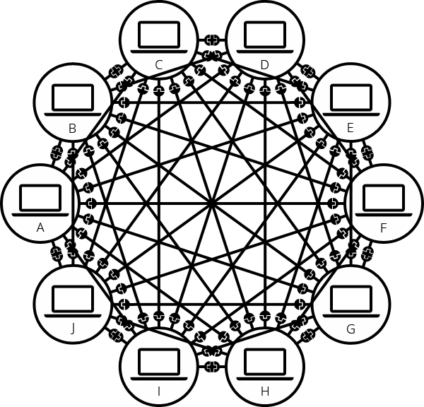
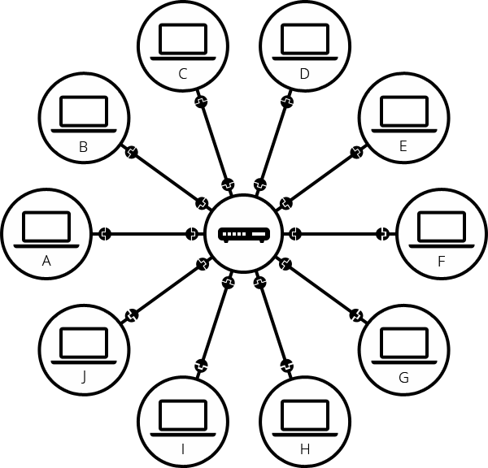
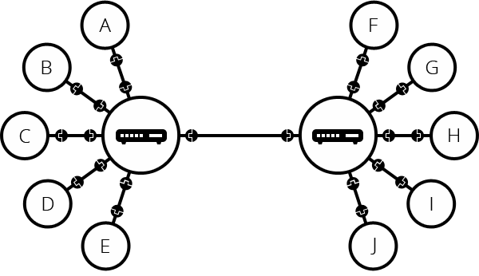
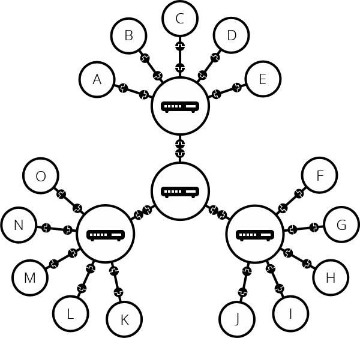
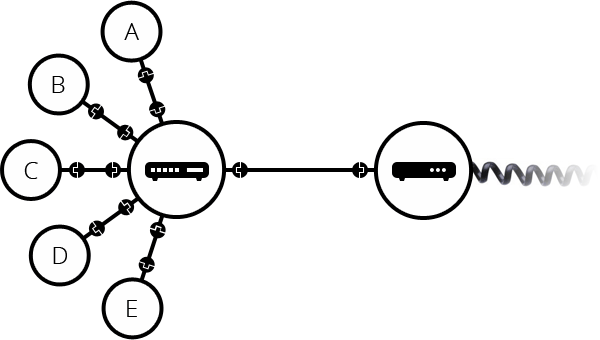
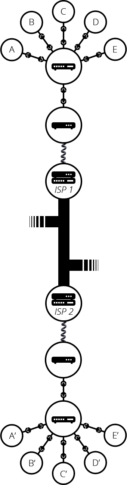
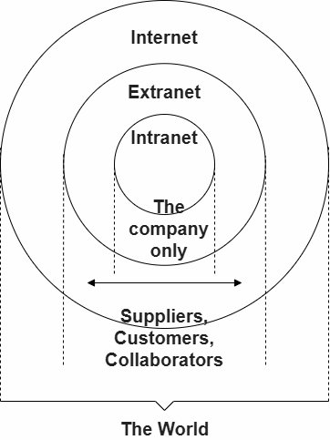

+++
date = '2026-05-13T00:00:00+08:00'
draft = false
title = 'Web 机制'
author = "todayyohoho"
tags = ['web']
+++
# Web机制

# 互联网是如何工作的？

互联网是 Web 的支柱，以这种技术为基础使 Web 成为可能。作为基础，互联网是把计算机互相连接起来的一个巨大网络。

[互联网的历史。](https://zh.wikipedia.org/wiki/%E4%BA%92%E8%81%94%E7%BD%91#%E5%8E%86%E5%8F%B2)它始于 1960 年美国军方资助的研究项目。1980 年在许多公共大学和公司的支持下，它演变为一种公共基础设施。随着时间的变化，各种各样的技术支持着互联网的发展，但是它的工作方式却没有改变多少：互联网确保所有计算机之间的连接，无论发生什么，它们依旧保持连接。

## 有关互联网的视频

[五分钟告诉你互联网是如何工作的](https://www.youtube.com/watch?v=7_LPdttKXPc)：Aaron Titus 在五分钟的一个视频中告诉你非常基础的互联网知识。

[互联网如何运作？](https://www.youtube.com/watch?v=x3c1ih2NJEg)：这是一个详细且可视化的 9 分钟视频。

## 深入探索

### 一个简单的网络

当两台计算机需要通信的时候，你必须要连接他们，无论通过有线方式（通常是网线）或是无线方式（比如 WiFi 或蓝牙）。所有现代计算机都支持这些连接。

备注：接下来的内容，我们将只谈论有线连接，而无线连接的原理与此相同。

通常一个网络不仅限于两台计算机。你可以尽你所想地连接计算机，但是情况立刻变得复杂了。如果你尝试连接，比如说十台计算机，每台电脑有九个插头，总共需要 45 条网线。

为了解决这个问题，网络上的每台计算机需要连接到一个叫做网络交换机（network switch）的小型特殊计算机。交换机只干一件事：就像火车站的调度员，它要确保从一台计算机上发出的消息仅可以到达目标计算机。为了把消息发送给计算机 B，计算机 A 必须把信息发送给交换机，交换机将收到的信息转发给计算机 B。计算机 B 不会收到发给其他计算机的消息，发给计算机 B 的消息也不会传到局域网上的其他计算机上。

一旦我们把交换机加入到这个系统，我们的网络中便只需要十条网线：每台计算机一个插口，交换机上十个插口。

### 网络中的网

到目前为止一切都很好。但是我们要连接成百上千、上亿台计算机呢？当然一台交换机覆盖不了这么远，但是，如果你阅读得比较认真，我们曾提到交换机像其他计算机一样，所以我们为什么不把两个交换机彼此连接呢？

你可以想象我们可以无限地将交换机连接起来，形成这样的网络：

但是在现实中，这样会导致许多工程问题。数据包需要经过的交换机越多，到达目的地的时间就越长。而且你不能只依赖这种树状结构的交换机集群，因为一旦某个交换机节点故障，就会导致大面积的断网，这会使你的网络变得脆弱。为了解决这个问题，我们将每个网络保持在一个较小的规模，并使用一种名为路由器（router）的设备来连接每个网络。路由器是一种负责在不同网络之间转发消息的计算机，其运作原理类似邮局：当数据包到达时，它会读取收件人的地址，直接将数据包转发给正确的收件人，而无需经过层层中转。

这样的网络与我们所说的互联网极为相似。我们只需通过物理介质（电缆）将所有路由器连接起来。幸运的是，在互联网出现之前，这样的基础设施早已存在——那就是电话网络。要将我们的网络连接到电话基础设施，需要一种名为调制解调器（modem）的特殊设备。该调制解调器能将我们网络中的消息转换为电话基础设施可处理的形式，反之亦然。

请注意，你家中的商用路由器很可能集成了交换机、路由器和调制解调器功能于一体。

因此我们已连接至电话基础设施。下一步是将我们网络中的消息发送至目标网络。为此，我们将通过互联网服务提供商（ISP）连接至互联网。ISP 是管理特殊路由器的公司，这些路由器相互连接，并能访问其他 ISP 的路由器。因此，来自我们网络的消息将通过 ISP 网络的网络传输至目标网络。整个互联网正是由这样的网络基础设施构成的。

### 寻找计算机

如果你想给一台计算机发送消息，你必须指明它是哪台计算机。因此，任何连接到网络中的计算机都需要有一个唯一的地址来标记它，叫做“IP 地址”（IP 代表互联网协议）。这个地址由四部分被点分隔的数字序列组成，比如：192.0.2.172。

这对于计算机来说完全没问题，但我们人类很难记住这种地址。为了使事情更简单，我们可以使用一个叫做域名的可读名称来替代 IP 地址。例如（在写作时，IP 地址可能会变化），google.com 是用于 IP 地址 142.250.190.78 的域名。所以使用域名是我们通过互联网访问计算机的最简单方式。

### 互联网和 Web

你可能注意到了，当我们通过浏览器上网的时候，我们通常是用域名去到达一个网站。这是否意味着互联网和 Web 是一样的？事实并非这么简单。正如向我们所见，互联网是一种基础的技术，它允许我们把成千上万的计算机连接在一起。在这些电脑中，有一些计算机（我们称之为 Web 服务器）可以发送一些浏览器可以理解的信息。互联网是基础设施，Web 是建立在这种基础设施之上的服务。值得注意的是，一些其他服务也同样运行在互联网之上，比如邮箱和 IRC。

### 内联网和外联网

内联网（Intranet）是仅限于特定组织成员使用的专用网络。它们通常用于为成员提供一个门户，以便安全地访问共享资源、进行协作和交流。例如，一个组织的内联网可能包含用于共享部门或团队信息的网页、用于管理关键文档和文件的共享驱动器、用于执行业务管理任务的门户网站，以及维基、讨论板和消息系统等协作工具。

外联网（Extranet）与内联网非常相似，只是它们开放了全部或部分专用网络，允许与其他组织共享和协作。外联网通常用于安全可靠地与客户和与企业密切合作的利益相关者共享信息。其功能通常与内联网类似：信息和文件共享、协作工具、讨论板等。

内联网和外联网都在与互联网相同的基础设施上运行，并使用相同的协议。因此，经授权的成员可以从不同的物理位置访问它们。

# Web服务器

## 概述

*web 服务器*一词可以代指硬件或软件，或者是它们协同工作的整体。

1. 硬件部分，web 服务器是一台存储了 web 服务器软件以及网站的组成文件（比如，HTML 文档、图片、CSS 样式表和 JavaScript 文件）的计算机。它接入到互联网并且支持与其他连接到互联网的设备进行物理数据的交互。
2. 软件部分，web 服务器包括控制网络用户如何访问托管文件的几个部分，至少是一台 ​*HTTP 服务器*​。一台 HTTP 服务器是一种能够理解 [URL](https://developer.mozilla.org/zh-CN/docs/Glossary/URL)（网络地址）和 [HTTP](https://developer.mozilla.org/zh-CN/docs/Glossary/HTTP)（浏览器用来查看网页的协议）的软件。一个 HTTP 服务器可以通过它所存储的网站域名进行访问，并将这些托管网站的内容传递给最终用户的设备。

基本上，当浏览器需要一个托管在网络服务器上的文件的时候，浏览器通过 HTTP 请求这个文件。当这个请求到达正确的 web 服务器（硬件）时，​*HTTP 服务器*​（软件）收到这个请求，找到这个被请求的文档（如果这个文档不存在，那么将返回一个 [404](https://developer.mozilla.org/zh-CN/docs/Web/HTTP/Reference/Status/404) 响应），并把这个文档通过 HTTP 发送给浏览器。

要发布一个网站，你需要一个静态或动态的服务器。

​**静态 web 服务器**（static web server）由一个计算机（硬件）和一个 HTTP 服务器（软件）组成。我们称它为“静态”是因为这个服务器把它托管文件的“保持原样”地传送到你的浏览器。

​**动态 web 服务器**​（dynamic web server）由一个静态的网络服务器加上额外的软件组成，最普遍的是一个*应用服务器*和一个​*数据库*。我们称它为“动态”是因为这个应用服务器会在通过 HTTP 服务器把托管文件传送到你的浏览器之前会对这些托管文件进行更新。

举个例子，要生成你在浏览器中看到的最终网页，应用服务器或许会用一个数据库中的内容填充一个 HTML 模板。像 MDN 或维基百科这样的网站有成千上万的网页。通常情况下，这类网站只由几个 HTML 模板和一个巨大的数据库组成，而不是成千上万的静态 HTML 文档。这种设置使得维护和提供内容更加容易。

## 深入探索

回顾一下：要获取一个网页，你的浏览器会向网络服务器发送一个请求，服务器会在自己的存储空间中搜索所请求的文件。找到文件后，服务器读取文件，根据需要进行处理，并将其发送给浏览器。让我们更详细地了解一下这些步骤。

### 托管文件

一个网络服务器首先需要存储这个网站的文件，也就是说所有的 HTML 文档和它们的相关资源，包括图片、CSS 样式表、JavaScript 文件、字体以及视频。

严格来说，你可以在你自己的计算机上托管所有的这些文件，但是在一个专用的 web 服务器上存储它们会方便得多，因为它

- 专用 web 服务器可用性更强（会一直启动和运行）
- 除去停机时间和系统故障，专用 web 服务器总是连接到互联网。
- 专用 web 服务器可以一直拥有一样的 IP 地址，这也称为​*专有 IP 地址*​（不是所有的 [ISP](https://developer.mozilla.org/zh-CN/docs/Glossary/ISP) 都会为家庭线提供一个固定的 IP 地址）
- 专用 web 服务器往往由第三方提供者维护

因为所有的这些原因，寻找一个优秀的托管提供者是建立你的网站的一个重要部分。比较不同公司提供的服务并选择一个适合你的需求和预算的服务（服务的价格从免费到每月上万美金不等）。你可以在[这篇文章](https://developer.mozilla.org/zh-CN/docs/Learn_web_development/Howto/Tools_and_setup/How_much_does_it_cost#%E4%B8%93%E4%B8%9A%E7%BD%91%E7%AB%99%E6%9C%BA%E6%9E%84%E5%92%8C%E6%89%98%E7%AE%A1)中找到更多的细节。

一旦你设置好一个网络托管解决方案，你必须[上传你的文件到你的 web 服务器](https://developer.mozilla.org/zh-CN/docs/Learn_web_development/Howto/Tools_and_setup/Upload_files_to_a_web_server)。

### [通过 HTTP 交流](https://developer.mozilla.org/zh-CN/docs/Learn_web_development/Howto/Web_mechanics/What_is_a_web_server#%E9%80%9A%E8%BF%87_http_%E4%BA%A4%E6%B5%81)

其次，web 服务器提供了 [HTTP](https://developer.mozilla.org/zh-CN/docs/Glossary/HTTP)（**H**yper**t**ext **T**ransfer **P**rotocol，超文本传输协议）支持。正如它的名字暗示，HTTP 明确提出了如何在两台计算机间传输超文本（链接的 web 文档）。

[协议](https://developer.mozilla.org/zh-CN/docs/Glossary/Protocol)是一套为了在两台计算机间交流而制定的规则。HTTP 是一个文本化的（textual），无状态的（stateless）协议。

[文本化](https://developer.mozilla.org/zh-CN/docs/Learn_web_development/Howto/Web_mechanics/What_is_a_web_server#%E6%96%87%E6%9C%AC%E5%8C%96)

所有的命令都是纯文本（plain-text）且人类可读（human-readable）的。

[无状态](https://developer.mozilla.org/zh-CN/docs/Learn_web_development/Howto/Web_mechanics/What_is_a_web_server#%E6%97%A0%E7%8A%B6%E6%80%81)

无论是服务器还是客户都不会记住之前的交流。举个例子，仅依靠 HTTP，服务器不能记住你输入的密码或者你正处于业务中的哪一步。你需要一个应用服务器来进行这样的工作。（我们会在其他文章中涵盖这类的技术。）

HTTP 为客户和服务器间的如何沟通提供清晰的规则。我们会在日后的一篇[技术文章](https://developer.mozilla.org/zh-CN/docs/Web/HTTP)中覆盖 HTTP 本身。就目前而言，只需要知道这几点：

- 通常只有*客户端*可以发送 HTTP 请求，只会发送到​*服务器*​。服务器通常只能*响应客户端*的 HTTP 请求。服务器也可以通过一种叫做[服务器推送](https://en.wikipedia.org/wiki/HTTP/2_Server_Push "外部链接（在新标签页中打开）")的机制，在客户请求之前，将数据填充到客户的缓存中。
- 当通过 HTTP 请求一个文件时，客户端必须提供这个文件的 [URL](https://developer.mozilla.org/zh-CN/docs/Glossary/URL)。
- 网络服务器*必须应答*每一个 HTTP 请求，至少也要回复一个错误信息。

在 web 服务器上，HTTP 服务器负责处理和响应传入的请求。

1. 当收到一个请求时，HTTP 服务器首先要检查所请求的 URL 是否与一个存在的文件相匹配。
2. 如果是，网络服务器会传送文件内容回到浏览器。如果不是，服务器会检查是否应该动态生成请求所需的文件（参见[静态和动态内容](https://developer.mozilla.org/zh-CN/docs/Learn_web_development/Howto/Web_mechanics/What_is_a_web_server#%E9%9D%99%E6%80%81%E5%92%8C%E5%8A%A8%E6%80%81%E5%86%85%E5%AE%B9)）。
3. 如果两种处理都不可能，网络服务器会返回一个错误信息到浏览器，最常见的是 [`404 Not Found`](https://developer.mozilla.org/zh-CN/docs/Web/HTTP/Reference/Status/404)。404 错误太常见以至于很多网页设计者花费许多时间去设计 404 错误页面。

   

### [静态和动态内容](https://developer.mozilla.org/zh-CN/docs/Learn_web_development/Howto/Web_mechanics/What_is_a_web_server#%E9%9D%99%E6%80%81%E5%92%8C%E5%8A%A8%E6%80%81%E5%86%85%E5%AE%B9)

粗略地说，一个服务器可以提供静态或者动态的内容。*静态*意味着“保持原样地提供”。静态的网站是最容易建立的，所以我们建议你制作一个静态的网站作为你的第一个网站。

“动态”意味着服务器会处理内容甚至实时地从一个数据库中产生它。这个方法提供了更多的灵活性，但技术栈更加复杂，使得建立一个网站的挑战大大增加。

不可能建议一个通用的应用服务器适用于所有可能的用例。一些应用服务器设计用于托管和管理博客、知识库或电子商务解决方案，而其他一些则更通用。如果你正在构建一个动态网站，请花时间研究你的需求，并找到最适合你需求的技术。

大多数网站开发者不需要从头开始创建应用服务器，因为有很多现成的解决方案，其中许多都可以高度配置。但是，如果你确实需要创建自己的服务器，那么你可能需要使用服务器框架，利用其现有的代码和库，并仅扩展你需要的部分以满足你的用例。只有相对较少的开发者需要完全从头开始开发服务器：例如，为了满足嵌入式系统上紧张的资源限制。如果你想尝试构建一个服务器，请浏览[服务器端网站编程](https://developer.mozilla.org/zh-CN/docs/Learn_web_development/Extensions/Server-side)学习路径中的资源。

‍
