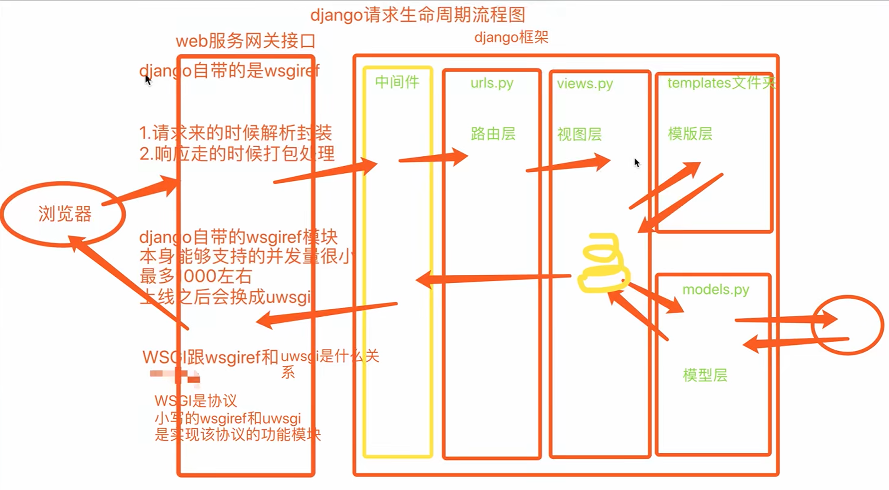

+++
date = '2026-05-20T00:00:00+08:00'
draft = false
title = 'Django 框架'
tags = ['web', 'python', 'django']
+++
# Django框架

## 创建项目

"""

1. 命令行创建不会自动创建templates文件夹并且也不会自动配置路径  
   DIR: [os.path.join(BASE_DIR, 'templates')]
2. pycharm则会自动创建并且自动配置路径
3. pycharm还可以自动帮你创建一个应用并且自动注册(只能创一个)  
   """

"""  
django主要文件介绍  
  -mysite  
    --mysite  
      ---urls.py	路由与视图函数对应关系  
      ---settings.py	配置文件  
      ...  
  -manage.py  
  -app01  
    --migrations  
          	数据库迁移记录  
    --apps.py  
    --tests.py  
    --models.py     数据库  
    --views.py     视图函数  
"""

‍

## django三把斧

```python
from django.shortcuts impot HttpRespose,render,redirect

return HttpRespose('字符串')
return render(request,'hello.html')
return redirect(url)
```

## 静态文件配置

```python
在浏览器中输入 url 能够看到对应的资源
是因为后端提前开设了该资源的接口
如果访问不到资源，说明后端没有开设该资源的接口

http://127.0.0.1:8000/static/bootstrap-3.3.7-dist/css/bootstrap.min.css
```

settings

```python
STATIC_URL = '/static/' #访问静态文件的令牌
# 想访问静态文件必须要以static开头
STATICFILES_DIRS = [
    os.path.join(BASE_DIR, 'static'),
	os.path.join(BASE_DIR, 'static1'),
	os.path.join(BASE_DIR, 'static2'),
]
```

html

```python
    <link rel="stylesheet" href="/static/bootstrap-3.4.1-dist/css/bootstrap.min.css">
    <script src="/static/bootstrap-3.4.1-dist/js/bootstrap.min.js"></script>

# /static/是令牌，不是路径
# 会从setting列表中依次检索目标文件，不再的话报错
```

静态文件的动态解析

```python

    <link rel="stylesheet" href="">
    <script src=""></script>
```

## 请求提交

```python
form表单action参数
不写：默认朝当前所在的 url 提交数据
全写：指名道姓（完整 URL 地址）
只写后缀：/login/（相对路径）

前期需要注释掉一行代码
MIDDLEWARE = [
    'django.middleware.security.SecurityMiddleware',
    'django.contrib.sessions.middleware.SessionMiddleware',
    'django.middleware.common.CommonMiddleware',
    # 'django.middleware.csrf.CsrfViewMiddleware',
    'django.contrib.auth.middleware.AuthenticationMiddleware',
    'django.contrib.messages.middleware.MessageMiddleware',
    'django.middleware.clickjacking.XFrameOptionsMiddleware',
]

<body>
    <h1 class="text-center">Login</h1>
<div class="container">
    <div class="row">
        <div class="col-md-8 col-md-offset-2">
            <form action="" method="post">
                <p>username:<input type="text" name="username" class="form-control"></p>
                <p>password:<input type="password" name="password" class="form-control"></p>
				<p>
                    <input type="checkbox" name="hobby" value="111">111
                     <input type="checkbox" name="hobby" value="222">222
                     <input type="checkbox" name="hobby" value="333">333
                </p>
                <input type="submit" class="btn btn-success btn-block">
            </form>
        </div>
    </div>
</div>
```

## request对象方法

```python
request.method 是全大写的字符串
request.POST # 获取用户post请求提交的数据
	request.POST.get() # 只取列表最后一个元素
	request.POST.getlist() # 取整个列表

elif request.method == 'POST':
	# 获取用户的请求数据
	# <QueryDict: {'username': ['jason'], 'password': ['123']}>
	# username = request.POST.get('username')
	# print(username, type(username))  # jason <class 'str'>

	# hobby = request.POST.get('hobby')
	# print(hobby, type(hobby))  # 333 <class 'str'>

	"""
	get只会获取列表最后一个元素
	"""

	username = request.POST.getlist('username')
	print(username, type(username))

	hobby = request.POST.getlist('hobby')
	print(hobby, type(hobby))

	"""
	['jason'] <class 'list'>
	['111', '222', '333'] <class 'list'>
	"""


	print(request.POST)
    return HttpResponse("收到了")

# 获取get请求提交的参数，即url后面的内容
print(request.GET)
print(request.GET.get('hobby'))
print(request.GET.getlist('hobby'))
return render(request, 'login.html')
```

## Django连接数据库

```python
1 配置文件中配置
DATABASES = {
    'default': {
        'ENGINE': 'django.db.backends.sqlite3',
        'NAME': os.path.join(BASE_DIR, 'db.sqlite3'),
    }
}

DATABASES = {
    'default': {
        'ENGINE': 'django.db.backends.mysql',
        'NAME': 'day60',
        'USER': 'root',
        'PASSWORD': '',
        'HOST': '127.0.0.1',
        'PORT': 3306,
        'CHARSET': 'utf8mb4'
    }
}

2 代码声明
django默认使用mysqldb连接，兼容性不好，手动改为pymysql模块
在项目名下init或任意应用名下init书写一下代码
import pymysql
pymysql.install_as_MySQLdb()
```

### Django ORM

"""  
ORM. 对象关系映射（Object Relational Mapping）  
作用: 能够让一个不用sql语句的小白也能够通过python 面向对象的代码简单快捷的操作数据库  
不足之处: 封装程度太高 有时候sql语句的效率偏低 需要你自己写SQL语句

类                  表  
对象                记录  
对象属性            记录某个字段对应的值  
"""

```python
# 1先去models.py中创建一个类
class User(models.Model):
    # id int primary_key auto_increment
    id = models.AutoField(primary_key=True)
    # username varchar(32)
    username = models.CharField(max_length=32， verbose_name='用户名')
	#CharField必须指定max_length参数
	#verbose_name所有字段都有，对字段的解释
    # password int
    password = models.IntegerField() 整数字段
**************************************2.数据库迁移命令 *****************************************
python manage.py makemigrations   将操作记录记录到migrations文件夹

python manage.py migrate 将数据真正同步到数据库中
**********************************************************************************************

    # 由于一张表中必须要有一个主键字段 并且一般情况下都叫id字段
    # 所以orm当你不定义主键字段的时候 orm会自动帮你创建一个名为id主键字段
```

### 字段的增删改查

```python
# 字段的增加
1. 可以在终端内直接给出默认值
2. 该字段可以为空
info = models.CharField(max_length=32, verbose_name='个人简介', null=True)
3. 直接给字段设置默认值
hobby = models.CharField(max_length=32, verbose_name='兴趣爱好', default='study')

# 字段的修改
直接改代码执行数据库迁移命令

# 字段的删除
注释掉相应字段再去执行两条命令
执行完毕后相应的数据就没有了

"""
操作时一定要细心
”””
```

### 数据的增删改查

```python
# 查
res = models.User.objects.filter(username = username)

"""
返回值 先看成是列表套数据对象的格式
它也支持索引取值、切片操作，但是不支持负数索引
它也不推荐你使用索引的方式取值
user_obj = models.User.objects.filter(username=username).first()
"""

filter括号内可以携带多个参数，参数与参数之间默认是and关系
把filter联想成where记忆


# 增
from app01 import models
res = models.User.objects.create(username=username, password=password)
# 返回值就是当前被创建的对象本身

# 第二种增加
user_obj = models.User(username=username, password=password)
user_obj.save()  # 保存数据

先将数据库中的数据全部展示到前端 然后给每一个数据两个按钮 一个编辑一个删除

def userlist(request):
     #查询数据表中的所有数据
     #方式一
    # data = models.User.objects.filter()
    # print(data)
    #方式二
    user_queryset = models.User.objects.all()
    # print(data)
    # return render(request,'userlist.html',{'user_queryset':user_queryset})
    return render(request,'userlist.html',locals())

编辑功能
点击编辑按钮朝后端发送编辑数据的请求
"""
如何告诉后端用户想要编辑哪条数据？
  将编辑按钮所在的那一行数据的主键值发送给后端
  利用url问号后面携带参数的方式
"""

<tbody>
                    
                    	<tr>
                        <td>{{ user_obj.id }}</td>
                        <td>{{ user_obj.username }}</td>
                        <td>{{ user_obj.password }}</td>
                        <td>
                            <a href="/edit_user/?user_id={{ user_obj.id }}" class="btn btn-primary btn-xs">编辑</a>
                            <a href="" class="btn btn-danger btn-xs">删除</a>
                        </td>
                        </tr>
                    
                    
                </tbody>

后端查询出用户想要编辑的数据对象 展示到前端页面供用户查看和编辑
def edit_user(request):
    edit_id = request.GET.get('user_id')
    edit_obj = models.User.objects.filter(id=edit_id).first()
    if request.method == 'POST':
        username = request.POST.get('username')
        password = request.POST.get('password')
        #修改数据的方式1
        models.User.objects.filter(id=edit_id).update(username=username,password=password)
        """
            将filter筛选出来的对象全部更新，批量更新操作
        """
        #修改数据的方式2
        edit_obj.username = username
        edit_obj.password = password
        edit_obj.save()
        """
            字段多的时候效率低下
            从头到尾将数据的所有字段全部更新，无论是否被修改
            不推荐使用
        """

        #跳转到数据的展示页面
        return redirect('/userlist')

    return render(request,'edit_user.html',locals())
    # return HttpResponse("删除用户")


删除功能
def delete_user(request):
    delete_id = request.GET.get('user_id')
    models.User.objects.filter(id=delete_id).delete()
    """
    批量删除
    """
    #跳转展示页面
    return redirect('/userlist')
删除数据不会真正的删除数据，会给数据添加一个标识字段，删除数据后会修改字段状态
```

### django orm创建表关系

```python
"""
表与表关系
一对一
author_detail = models.OneToOneField(to='AuthorDetail')
一对多
publish = models.ForeignKey(to='Publish')
多对多
authors = models.ManyToManyField(to='Author')
""" 
django1.x版本中默认是级联更新删除的
多对多表关系有多种创建方式
```

### django请求生命周期流程图



## django

### 路由层

#### 路由匹配

```python
    url(r'test',views.test),
    url(r'testadd', views.testadd),
"""
url第一个参数是正则表达式
只要第一个参数能够匹配到内容，那么就会立刻停止往下匹配
直接执行对应的视图函数
^是以什么开头
"""
    url(r'test/',views.test),
    url(r'testadd/', views.testadd),
django的功能：在浏览器输入test后匹配不成，浏览器会默认加/在匹配一次
不自动还斜杠：setting中：APPEND_SLASH=False
url(r'^test/$',views.test),
以什么开头以什么结尾

#首页匹配
    url(r'^$',views.home),
    #路由匹配
    url(r'^test/$',views.test),
    url(r'^testadd/$', views.testadd),
    #尾页
    url(r'',views.error),
```

#### 无名分组

```python
"""
分组：某一段正则表达式用小括号括起来
"""
url(r'^test/(\d+)/',views.test),

def test(request,xx):
    print(xx)
    return HttpResponse("test")

无名分组就是将正则表达式匹配到的内容当做未知参数传递给视图函数
```

#### 有名分组

```python
"""
给正则表达式起一个别名
"""
url(r'^testadd/(?P<year>\d+)', views.testadd),

def testadd(request,year):
    print(year)
    return HttpResponse("testadd")

有名分组就是将括号内正则表达式匹配到的内容当作关键字参数传递给后面的视图函数
```

#### 无名有名不能混用

```python
# 1. 位置参数版路由
url(r'^index/(\d+)/(\d+)/(\d+)/', views.index),

# 2. 关键字参数版路由（命名分组）
url(r'^index/(?P<year>\d+)/(?P<age>\d+)/(?P<month>\d+)/', views.index),
```

#### 反向解析

```python
# 通过一些方法得到一个结果 该结果可以直接访问对应的url触发视图函数

# 先给路由与视图函数起一个别名
url(r'^func_kkk/', views.func, name='ooo')

# 反向解析
# 后端反向解析
from django.shortcuts import render, HttpResponse, redirect, reverse
reverse('ooo')

# 前端反向解析
<a href="">111</a>
```

‍
