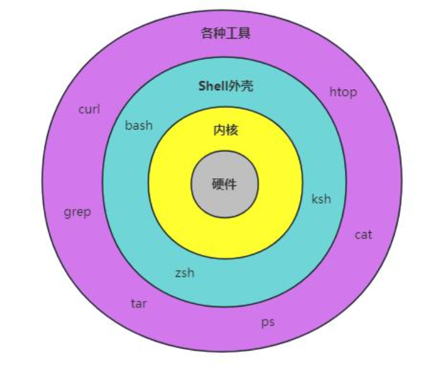

+++
date = '2026-05-16T00:00:00+08:00'
draft = false
title = '终端扫盲'
author = "todayyohoho"
tags = ['终端', 'linux']
+++
# 终端扫盲

## shell

定义：

Shell 既是一种命令语言，又是一种程序设计语言。

Shell 是指一种应用程序，是用户与操作系统交互的接口，这个应用程序提供了一个界面，用户通过这个界面访问操作系统内核的服务。

类型：

- **命令行式 Shell**（CLI）（Command Line Interface）：如 bash、cmd、PowerShell。
- **图形化 Shell**（GUI）（Graphical User Interface）：如 Windows 资源管理器。

## 三种shell

bash：Bash（Bourne Again Shell）是 Linux/macOS 的默认 Shell，基于 Unix 的命令行工具。

cmd：CMD（Command Prompt）是 Windows 的传统命令行工具

powershell：PowerShell 是微软开发的现代化命令行工具，基于 .NET 框架，支持跨平台（Windows、Linux、macOS）。

|**特性**|**CMD (命令提示符)**|**PowerShell**|**Bash**|
| ----| ------------------------| -------------------------| -----------------------------------|
|**原生系统**|Windows|Windows (现已跨平台)|Linux / Unix / macOS|
|**设计哲学**|MS-DOS 遗留，简单执行|**一切皆对象 (Object-oriented)**|**一切皆文本 (Text-oriented)**|
|**管道传递 (**​ **​`\|`​** ​ **)**|纯文本字符串| **.NET 对象**|纯文本流|
|**脚本语言**|Batch (批处理，功能弱)|极为强大 (支持复杂编程)|强大 (Shell Script，依赖外部工具)|
|**扩展性**|极低|极高 (直接调用 .NET 库)|高 (依赖庞大的 Linux 工具链)|

## 常用指令

### 目录与文件导航

|**功能描述**|**Bash (Linux/Mac)**|**Windows (CMD)**|**Windows (PowerShell)**|**实用场景示例 (Bash)**|
| --| ------| ------| ----------| ------------------------------------------------|
|**查看当前路径**|​`pwd`|​`cd`|​`Get-Location`​(`pwd`)|迷失在深层目录时确认当前位置。|
|**列出目录内容**|​`ls`|​`dir`|​`Get-ChildItem`​(`ls`)|​`ls -la`：查看包括隐藏文件在内的所有文件详细信息。|
|**切换目录**|​`cd [路径]`|​`cd [路径]`|​`Set-Location`​(`cd`)|​`cd ..`​返回上一级；`cd ~`回到用户主目录。|

### 文件与目录操作

|**功能描述**|**Bash (Linux/Mac)**|**Windows (CMD)**|**Windows (PowerShell)**|**实用场景示例 (Bash)**|
| --| ------| ---------| ----------| ------------------------------------------------------------|
|**创建目录**|​`mkdir [目录名]`|​`md [目录名]`|​`New-Item -ItemType Directory`|​`mkdir project_01`创建一个新项目文件夹。|
|**删除空目录**|​`rmdir`|​`/`|​`/`|​`rmdir old_directory`|
|**创建空文件**|​`touch [文件名]`|​`type nul > [文件名]`|​`New-Item [文件名]`|​`touch main.c`​或`touch script.py`快速建构代码文件。|
|**复制文件/目录**|​`cp [源] [目标]`|​`copy`​/`xcopy`|​`Copy-Item`​(`cp`)|​`cp config.ini config.bak`备份配置文件。|
|**移动/重命名**|​`mv [源] [目标]`|​`move`|​`Move-Item`​(`mv`)|​`mv old_name.py new_name.py`更改脚本名称。|
|**删除文件**|​`rm [文件名]`|​`del`|​`Remove-Item`​(`rm`)|​`rm test.txt`​删除文件。（⚠️注意：`rm -rf`会强制删除非空目录且不可逆）。|
|**在目录树中搜索文件**|​`find 起始路径 -条件 "匹配内容"`|​`/`|​`/`|​`find /path/to/search -name "filename.txt"`|

### 文本查看与处理

|**功能描述**|**Bash (Linux/Mac)**|**Windows (CMD)**|**Windows (PowerShell)**|**实用场景示例 (Bash)**|
| --| ----------| ------| ----------| ----------------------------------------------------------|
|**查看整个文件**|​`cat [文件名]`|​`type [文件名]`|​`Get-Content`​(`cat`)|​`cat flag.txt`快速读取文本内容。 使用`-n`可以显示具体的某一行 `bash cat -n filename.txt` |
|**分页查看长文件**|​`less [文件名]`|​`more [文件名]`|​`more`|查看极长的 Apache 或系统报错日志时使用，按`q`退出。|
|**查看文件的前几行和后几行**|​`head`​和`tail`|​`/`|​`/`|​`bash head filename.txt ` # 默认显示前10行 `tail filename.txt`  # 默认显示最后10行 |
|**文本内容过滤**|​`grep "[字符]" [文件]`|​`findstr`|​`Select-String`|​`grep "error" server.log`快速找出日志中的报错行。|
|**Word Count（单词计数）**|​`wc 文件名`|​`/`|​`/`|输出 `5  12  60 test.txt（行数，单词，字节）` `-l `只统计行数 |

‍

### 系统与进程管理

|**功能描述**|**Bash (Linux/Mac)**|**Windows (CMD)**|**Windows (PowerShell)**|**实用场景示例 (Bash)**|
| --| ---------| --------------| --------------------| ---------------------------------------------------------------------|
|**查看运行进程**|​`ps aux`​/`top`|​`tasklist`|​`Get-Process`​(`ps`)|​`top`可以实时动态查看占用 CPU 和内存最高的程序。|
|**强制结束进程**|​`kill -9 [PID]`|​`taskkill /PID`|​`Stop-Process`​(`kill`)|当某个死循环的 Python 脚本或卡死的服务占用资源时，通过 PID 杀掉它。|
|**修改文件权限**|​`chmod [权限] [文件]`|​`icacls`(较复杂)|无直接等效，用 ACL|​`chmod +x script.sh`赋予脚本可执行权限，这是运行本地脚本前必做的一步。|
|**更改文件或目录的所有者**|​`chmod [新持有者] [文件]`|​`/`|​`/`|​`sudo chown new_owner filename.txt`|

### 网络与连接

- ​**​`ping [域名/IP]`​**  (跨平台通用)：测试网络连通性。
- ​**​`curl [URL]`​**  (Bash / PS)：在终端里发送网络请求，获取网页源代码或 API 响应。

  - *示例：*  `curl http://localhost:8080` 测试本地搭建的 Web 服务是否正常响应。
- ​**​`netstat -ano`​** (跨平台，参数略有不同)：查看当前系统的网络连接和端口占用情况。排查例如 "Apache 启动失败因为 80 端口被占用" 这类问题时的核心指令。
- ​`wget`​：从网页上下载文件，`wget http://example.com/file.zip`
- ​`ssh`​：远程登录到另一台计算机，`ssh username@remote_host`

### 技巧

- tab键自动补全，输入文件路径或命令前几个字母时，自动补全内容
- ctrl+⬆️/⬇️执行以前的命令
- ctrl+c打断命令的执行

## 管道符

​`|`​是Linux系统的管道命令操作符，使用此管道符可以将两个命令分隔开，`|`​左边的命令的输出会作为`|`右边命令的输入，此命令可以连续使用

例如：`cat hello.sh | sort | uniq | grep 'better’`

读取文件内容，排序，去重

### 常见应用场景

- 统计当前目录有多少个文件

	`ls | wc -l`

	`cat /etc/passwd | wc -l`

- 过滤文件内容

	假设我们需要从`/etc/passwd`​文件中找出以`root`开头的行，可以使用以下命令：

	`grep '^root' /etc/passwd`

	如果需要进一步过滤掉注释行和空行，可以使用管道符：

	`grep '^root' /etc/passwd | grep -v '^#' | grep -v '^$'`

	上述命令中，`grep -v '^#'`​会过滤掉以`#`​开头的注释行，`grep -v '^$'`会过滤掉空行。

- 分屏显示

	在处理大量输出时，可以使用`less`​或`more`实现分屏显示。

	`ls -lh /etc | less`

	述命令中，`ls -lh /etc`​会列出`/etc`​目录下的文件信息，`less`则实现分屏显示。

- 统计特定文件的数量

	假设我们需要统计`/etc`​目录下所有以`.conf`结尾的文件数量，可以使用以下命令：

	`find /etc -name "*.conf" | wc -l`

- 提取特定行

	假设我们需要从`/etc/passwd`文件中提取第10行，可以使用以下命令：

	`head -n 10 /etc/passwd | tail -n 1`

	`head -n 10 /etc/passwd`​会提取前10行，`tail -n 1`则提取最后1行。

‍
